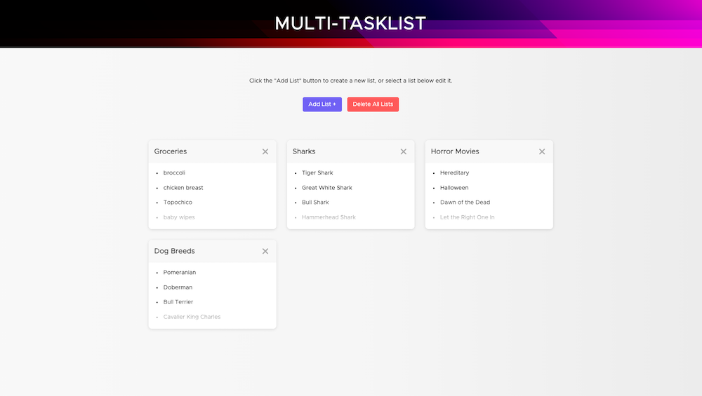
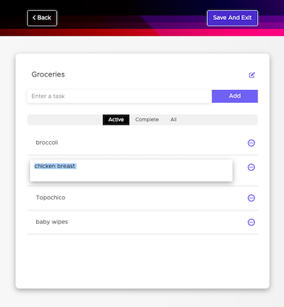
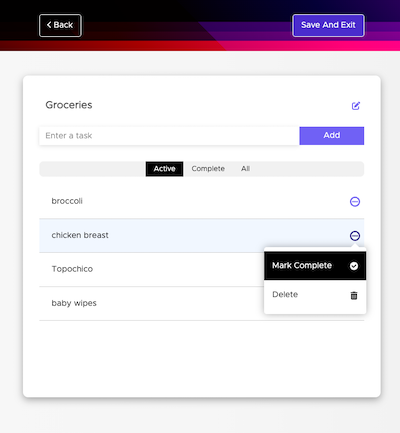

# Multi-Tasklist

<em>Multi-Tasklist</em> is a web application that you can use to create multiple todo lists. You can create, read, update, or delete the lists. The lists are stored locally using the browser's localStorage.

## View Demo

Play around with the app [here](https://multi-tasklist.netlify.app), or enter <em>https://multi-tasklist.netlify.app</em> in your browser's address bar.



|  |  |
| :------------------------------------------: | :------------------------------------------------: |

Follow the Installation and Instructions steps to clone the repo and run the app locally.

## Built with

- create-react-app

- React Router DOM

  - Used for routing between components without refreshing the page.

- [Redux](https://redux.js.org/) and [React-Redux](https://react-redux.js.org/)

  - Used for state management.

- Web Storage API

  - Used for persisting list data on page refresh, or when user leaves and revisits the page.

- [uuid](https://www.npmjs.com/package/uuid)

  - Package used for creating unique identifiers for lists and list items.

- [styled-components](https://styled-components.com/)

  - Used for all styling.

## Installation and Instructions

#### Step 1 - Clone the repo, then open it in your code editor.

```zsh
$ git clone https://github.com/agviray/react-multi-tasklist.git
```

#### Step 2 - From the app's root directory, install all of the dependencies that are required to run the app.

```zsh
$ npm install
```

#### Step 3 - Run the app from the root directory.

```zsh
$ npm start
```
